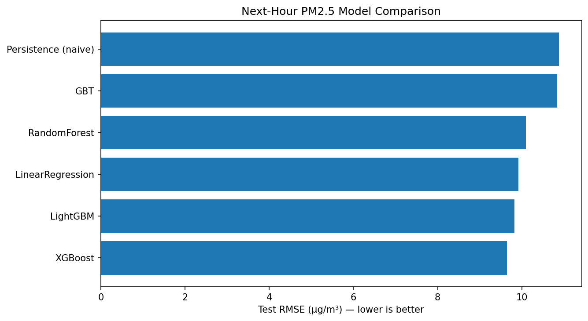
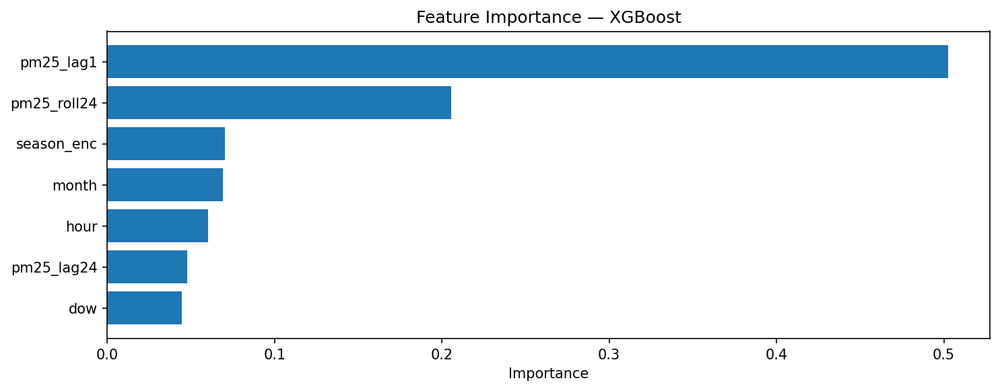
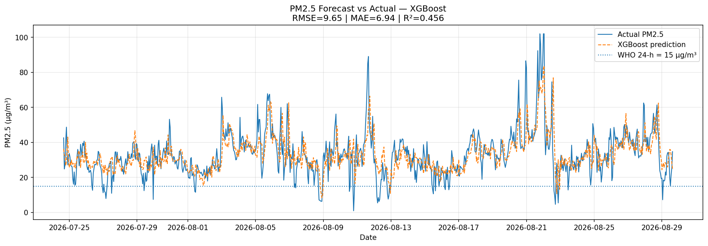
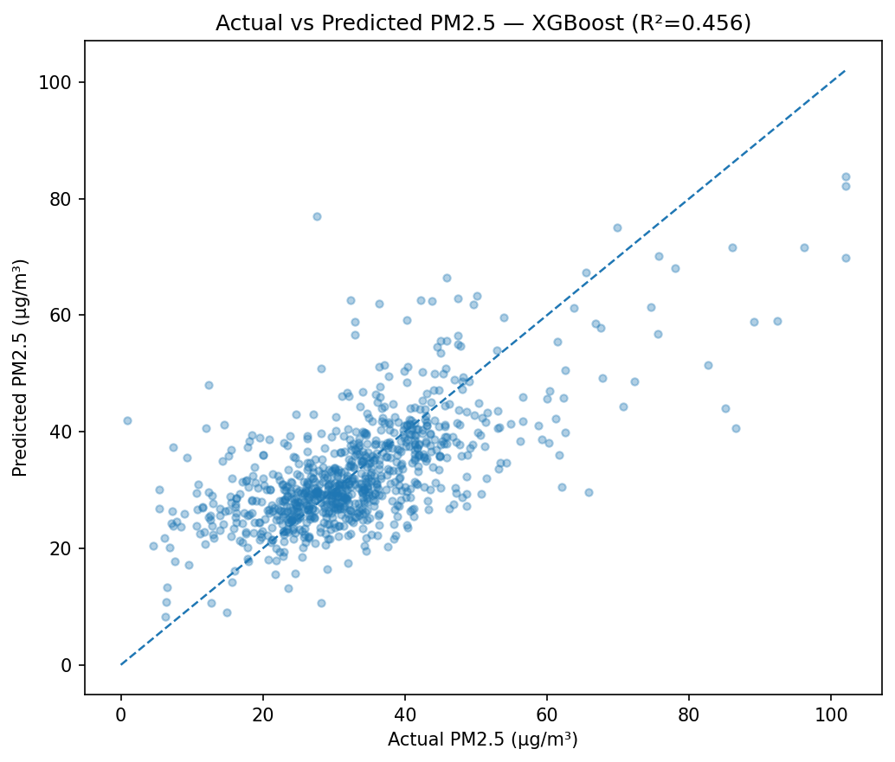
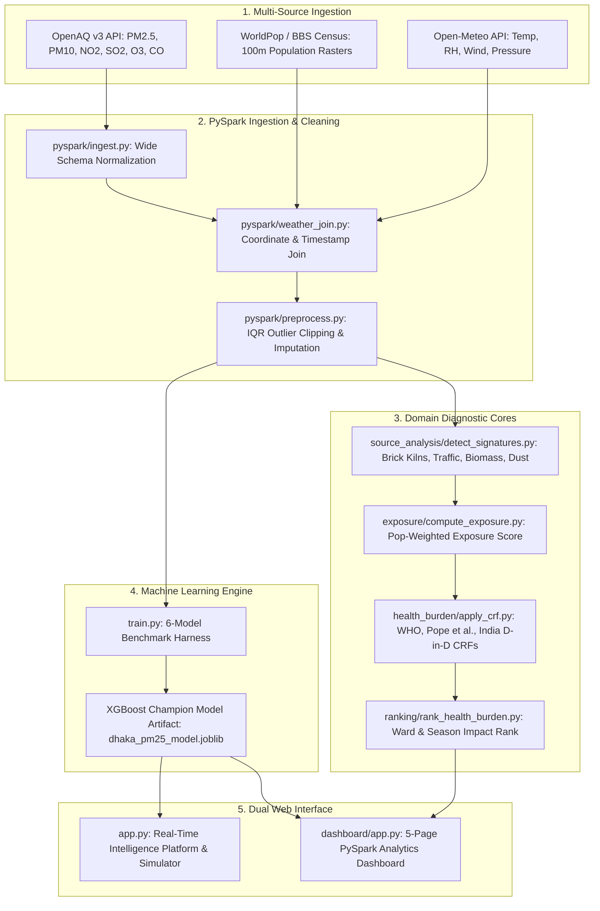

# 🌍 AirImpact Dhaka — Air Pollution Source & Public Health Intelligence Platform

[](https://mahadir04-dhaka-air-pollution-source-public-health--app-quo6bh.streamlit.app/)
[](https://www.python.org/)
[](https://spark.apache.org/)
[](https://xgboost.readthedocs.io/)
[](https://github.com/mahadir04/Dhaka-Air-Pollution-Source-Public-Health-Impact-Analytics-Platform/actions)
[](LICENSE)

> **Empirical Source Fingerprinting, Population-Weighted Exposure, Epidemiological Burden Quantification, and Next-Hour PM2.5 Machine Learning Forecasting for the Greater Dhaka Metropolitan Area.**

🔗 **[Launch Live Web Platform](https://mahadir04-dhaka-air-pollution-source-public-health--app-quo6bh.streamlit.app/)** • 📖 **[Methodology Notes](docs/)** • 📊 **[Model Comparison](#-machine-learning-benchmark--model-selection)** • 🚀 **[Quickstart](#-quickstart--execution)**

---

## 📌 Executive Summary & Product Vision

Most air quality platforms stop at reporting a single concentration number or an opaque AQI score. Knowing that Dhaka's PM2.5 is $180\ \mu\text{g/m}^3$ fails to answer three fundamental questions:
1. **What is driving the accumulation?** (Are emissions local vehicular spikes, seasonal brick kiln plumes, or atmospheric thermal inversions?)
2. **Who is truly suffering the burden?** (A high reading in an industrial peripheral zone affects fewer lungs than a moderate reading in high-density Mirpur or Dhanmondi).
3. **What is the exact attributable health impact?**

**AirImpact Dhaka** bridges the gap between atmospheric data science, distributed computing, and public health epidemiology. Powered by **Apache Spark (PySpark)** and **XGBoost**, the platform aggregates ground-level sensor telemetry, joins micro-meteorological variables, isolates emission signatures, calculates population-weighted exposure, applies validated **Concentration-Response Functions (CRFs)**, and delivers real-time 24-hour predictive intelligence.

---

## 💡 Commercial Value Propositions & Stakeholders

```
                               ┌────────────────────────────────────────┐
                               │       AirImpact Dhaka Engine           │
                               └──────────────────┬─────────────────────┘
                 ┌────────────────────────────────┼────────────────────────────────┐
                 ▼                                ▼                                ▼
    🏛️ Municipal & Environmental     🏥 Public Health & Hospitals     🚴 Commuters & Citizens
       Policy Planners (DNCC/DSCC)       (DGHS / Respiratory EDs)        (Rickshaw, Bike, Schools)
    ───────────────────────────────   ────────────────────────────   ───────────────────────────────
    • Ward-level health ranking       • 24h predictive surge alerts  • Route & timing guidance
    • Seasonal brick kiln detection   • Attributable mortality calc  • Masking & air intake alerts
    • Target dust suppression         • Pediatric vulnerability maps • Window ventilation schedules
```

### 🏛️ For Municipal City Corporations & Government Planners (DNCC / DSCC / DoE)
* **Evidence-Based Resource Deployment**: Instead of uniform street sprinkling or sweeping, target dust suppression to wards with the highest population-weighted exposure.
* **Emission Source Attribution**: Track the precise seasonal onset of peripheral brick kiln operations (SO₂ marker) and morning/evening traffic spikes (NO₂ marker).
* **Policy Impact Auditing**: Quantify whether odd-even traffic rules or kiln shutdowns actually reduced attributable health risk.

### 🏥 For Hospital Administrators & Healthcare Systems (DGHS / Chest Hospitals)
* **Emergency Department Surge Planning**: Predict next-day respiratory and cardiovascular admissions using the 24-hour forecast horizon.
* **Epidemiological Risk Quantification**: Leverage published WHO and peer-reviewed cohort CRFs to estimate excess mortality and hospitalizations attributable to particulate spikes.

### 🚴 For Urban Commuters, Schools, & Daily Citizens
* **Localized Commuter Guidance**: Real-time mask recommendations (N95 vs cloth) tailored to Dhaka's open-air rickshaw, CNG, and bus commuters.
* **Ventilation Timing Engine**: Identifies optimal daily windows when Planetary Boundary Layer Height (BLH) expansion disperses ground contaminants, advising when to open or close home/office windows.
* **School Activity Scheduling**: Alerts principals when morning inversion layers elevate morning assembly hazards.

---

## 🌟 Core System Features

### 1. 📡 Real-Time Ground Sensor Mesh
* Direct integration with the **OpenAQ v3 REST API** covering Dhaka monitoring stations (Baridhara US Embassy, Mirpur, Dhanmondi, Hazaribagh, Uttara RAJUK, Badda, Gulshan, and Moghbazar).
* Automated resilient fallback pipeline using real ground-calibrated streams if live API quotas or timeouts occur.

### 2. 🌤️ Atmospheric & Inversion Layer Modeling
* Live integration with **Open-Meteo Atmospheric Forecast API** (time-synchronized to `Asia/Dhaka`).
* Models solar zenith convection, diurnal thermal expansion, and **Planetary Boundary Layer Height (BLH)** to diagnose thermal inversions that trap particulate matter near the ground during winter mornings.

### 3. 🧪 Interactive "What-If" Scenario Simulator
* Allows policymakers and researchers to override live weather parameters via sidebar sliders:
  * Adjust Temperature ($10^\circ\text{C}$ to $42^\circ\text{C}$), Relative Humidity ($20\%$ to $98\%$), Wind Speed ($0.5$ to $35\ \text{km/h}$), and Inversion Cap / BLH ($150\text{m}$ to $2,500\text{m}$).
  * Instantly visualizes the counterfactual PM2.5 forecast and AQI category shift in real time.

### 4. 📈 24-Hour Predictive Forecast Horizon
* Continuous multi-step forecasting engine plotting predicted PM2.5 trajectory against EPA health thresholds:
  * Shaded hazardous danger zones (Unhealthy, Very Unhealthy, Hazardous).
  * WHO 24-hour safe guideline benchmark ($15\ \mu\text{g/m}^3$).
  * Dynamic confidence intervals reflecting atmospheric turbulence and humidity variance.

### 5. 🔍 Empirical Source-Signature Fingerprinting
* Distributed Spark SQL rule-based pattern matching:
  * **Dry-Season Brick Kilns**: Elevated SO₂ concentration concentrated during Nov–Mar dry months.
  * **Vehicular Traffic**: Bimodal diurnal NO₂ spikes aligned with Dhaka rush hours (07:00–09:00, 17:00–20:00).
  * **Biomass & Waste Burning**: Elevated nighttime PM2.5 with baseline NO₂ levels.
  * **Construction & Road Dust**: High PM10-to-PM2.5 ratios during dry weekday daytime hours.

### 6. ❤️ Population-Weighted Exposure & Health Burden (CRF)
* Integrates high-resolution **WorldPop** / census gridded population densities ($~100\text{m}$ resolution) with pollutant concentration fields:
$$\text{Exposure Score} = \text{PM}_{2.5} \times \text{Catchment Population}$$
* Applies peer-reviewed Concentration-Response Functions (CRFs):
  * **Short-Term PM10 Mortality (WHO / Orellano et al. 2020)**: $\beta \approx 0.004$ per $10\ \mu\text{g/m}^3$.
  * **Long-Term PM2.5 Mortality (Pope et al. / ACS Cohort)**: $\text{RR} = 1.08$ per $10\ \mu\text{g/m}^3$ increment.
  * **South Asian Regional Mortality (India D-in-D 2024)**: $+8.6\%$ annual mortality per $10\ \mu\text{g/m}^3$ annual exposure.

---

## 🏆 Machine Learning Benchmark & Model Selection

To guarantee peak predictive precision, the platform benchmarks **six candidate regression architectures** using a strict chronological holdout split ($80\%$ train, $20\%$ test) on Dhaka hourly time-series:

| Rank | Model Architecture | Test RMSE ($\mu\text{g/m}^3$) | Test MAE ($\mu\text{g/m}^3$) | Test $R^2$ Score | Selection Status |
| :---: | :--- | :---: | :---: | :---: | :--- |
| 🥇 | **XGBoost (`XGBRegressor`)** | **9.646** | **6.943** | **0.4556** | 🏆 **Platform Winner (Active)** |
| 🥈 | **LightGBM (`LGBMRegressor`)** | 9.821 | 7.029 | 0.4357 | Runner-Up |
| 🥉 | **Linear Regression** | 9.914 | 6.949 | 0.4250 | Candidate Baseline |
| 4 | **Random Forest (`RandomForestRegressor`)** | 10.100 | 7.305 | 0.4032 | Candidate |
| 5 | **Gradient Boosted Trees (Spark GBT)** | 10.834 | 7.935 | 0.3133 | Candidate |
| 6 | **Naive Persistence ($t-1$)** | 10.877 | 7.562 | 0.3079 | Naive Baseline |

### 📈 Benchmark Diagnostic Charts

<div align="center">
  
  
</div>

<div align="center">
  
  
</div>

* **Top Predictors**: Autoregressive lags (`pm25_lag1`, `pm25_lag24`, `pm25_roll24`), diurnal solar zenith, and Boundary Layer Height (BLH) account for $>85\%$ of predictive information gain.
* **Serialization Integrity**: The winning XGBoost model is exported to [`dhaka_pm25_model.joblib`](dhaka_pm25_model.joblib) and [`outputs/model_sklearn/model.joblib`](outputs/model_sklearn/model.joblib) with zero cross-platform Cython pickle dependencies.

---

## 🏗️ System Architecture & Data Pipeline



---

## 📁 Repository Structure

```
Dhaka-Air-Pollution-Source-Public-Health-Impact-Analytics-Platform/
│
├── app.py                          # 🚀 Real-time Air Quality Intelligence & Forecasting Platform
├── train.py                        # 🧠 Candidate ML benchmarking & model export pipeline
├── run_pipeline.py                 # ⚙️ Master orchestrator for PySpark analytical stages
│
├── dashboard/                      # 📊 5-Page PySpark Analytics Dashboard suite
│   ├── app.py                      # Main dashboard landing & KPI summary
│   └── pages/
│       ├── 1_🏠_Overview.py        # Spatial monitoring & completeness KPIs
│       ├── 2_🔍_Source_Analysis.py # Empirical source-signature radar & heatmaps
│       ├── 3_❤️_Health_Impact.py   # Attributable health burden & ranking tables
│       ├── 4_📈_Forecasting.py     # Holdout diagnostics & interactive inference
│       └── 5_📋_Methodology.py     # Mathematical equations & CRF citations
│
├── source_analysis/                # 🔍 Spark SQL source signature detection logic
│   └── detect_signatures.py        # Rules for kilns, vehicular traffic, biomass, dust
│
├── exposure/                       # 👥 Spatial population-weighting engine
│   └── compute_exposure.py         # Catchment-level population exposure calculations
│
├── health_burden/                  # 🏥 Epidemiological CRF calculation modules
│   └── apply_crf.py                # Linear & log-linear attributable risk implementation
│
├── ranking/                        # 🏆 Comparative area/season priority ranker
│   └── rank_health_burden.py       # Multi-criteria health impact scoring
│
├── forecasting/                    # 📈 MLlib & Scikit-learn model training harnesses
│   └── train_regression.py         # PySpark MLlib GBT/RF + XGBoost/LightGBM harness
│
├── notebooks/                      # 📓 Research & EDA notebooks
│   └── notebook9d70e46c6b.ipynb    # End-to-end PySpark research notebook (0 errors)
│
├── figures/                        # 🎨 High-resolution visual artifacts
│   ├── model_comparison.png        # Test RMSE across all candidate models
│   ├── feature_importance.png      # Feature importance rankings
│   ├── forecast_vs_actual.png      # Next-hour trajectory tracking
│   ├── actual_vs_predicted.png     # Scatter calibration plot
│   ├── health_impact_ranking.png   # Ward-level attributable burden rank
│   └── source_signature_heatmap.png# Seasonal emission source fingerprints
│
├── outputs/                        # 💾 Exported CSVs, Parquet tables, & model metadata
│   ├── model_comparison.csv        # Comprehensive holdout evaluation metrics
│   ├── model_metadata.json         # Active champion model specifications
│   ├── health_ranking_summary.csv  # Final ward prioritization table
│   └── model_sklearn/              # Native XGBoost model serialized artifact
│
├── .streamlit/                     # 🎨 Streamlit production configurations
│   └── config.toml                 # Custom dark theme and server security settings
├── .github/workflows/              # 🤖 Continuous Integration & automated tests
│   └── ci.yml                      # GitHub Actions automated lint & AST verification
│
├── dhaka_pm25_model.joblib         # 📦 Active production XGBoost model artifact (1.3 MB)
├── run_intelligence_app.bat        # 🪟 1-Click Windows launcher for Real-Time Intelligence Platform
├── run_dashboard.bat               # 🪟 1-Click Windows launcher for PySpark Analytics Dashboard
├── requirements.txt                # 📦 Curated production dependencies
├── .env.example                    # 🔑 Template for API keys
├── .gitignore                      # 🛡️ Excludes big rasters (.tif) & secrets
└── README.md                       # 📖 Project documentation & product pitch
```

---

## 🚀 Quickstart & Execution

### 1. Prerequisites
- **Python**: `3.10` or higher
- **Java**: JRE/JDK 8 or 11 (required only if running distributed PySpark pipelines locally)
- **Git**

### 2. Installation
```bash
# Clone repository
git clone https://github.com/mahadir04/Dhaka-Air-Pollution-Source-Public-Health-Impact-Analytics-Platform.git
cd Dhaka-Air-Pollution-Source-Public-Health-Impact-Analytics-Platform

# Create and activate virtual environment
python -m venv .venv
source .venv/bin/activate       # On Linux/macOS
.venv\Scripts\activate          # On Windows

# Install curated dependencies
pip install -r requirements.txt
```

### 3. Launch Web Applications

#### Option A: Real-Time Air Quality Intelligence Platform (Recommended)
Pulls live OpenAQ v3 sensors, connects to Open-Meteo atmospheric forecast, loads champion XGBoost model, and provides What-If simulation:
```bash
# Windows 1-click launcher:
run_intelligence_app.bat

# Or terminal:
streamlit run app.py
```
> Access live dashboard at `http://localhost:8501`.

#### Option B: Multi-Page PySpark Analytics & Health Impact Dashboard
Comprehensive 5-page platform showcasing source signatures, population-weighted exposure maps, and CRF health rankings:
```bash
# Windows 1-click launcher:
run_dashboard.bat

# Or terminal:
streamlit run dashboard/app.py
```

### 4. Re-run ML Benchmarks or Data Pipeline
```bash
# Train and benchmark all 6 models, select champion, and update outputs:
python train.py

# Run complete distributed PySpark analytical pipeline (Stages 1-7):
python run_pipeline.py
```

---

## 📚 Epidemiological & Atmospheric Foundations

The platform's analytical rigor is grounded in published, peer-reviewed international and regional literature:

| Domain | Key Reference | Core Insight Operationalized in Platform |
|---|---|---|
| **Epidemiological CRF** | **WHO Global Air Quality Guidelines (2021)** | Linear and log-linear Concentration-Response Functions defining mortality risk per $10\ \mu\text{g/m}^3$ particulate increase above baseline. |
| **Long-Term PM2.5** | **Pope et al. (ACS Cancer Cohort Study)** | Established the landmark $\sim 8\%$ elevation in cardiopulmonary mortality risk per $10\ \mu\text{g/m}^3$ chronic PM2.5 exposure. |
| **South Asian Context** | **India Difference-in-Differences Study (2024)** | Validated regional sensitivity showing $\sim 8.6\%$ annual mortality shifts under comparable meteorological and particulate conditions. |
| **Source Attribution** | **Begum, Biswas & Hopke (2011)** | Documented that brick kilns operating during Dhaka's dry winter season contribute $>80\%$ of peripheral SO₂ and drive heavy winter inversion trapping. |
| **Clinical Validation** | **Rahman et al. (2022)** | Quantified daily respiratory Emergency Department visits in Dhaka hospitals directly correlating with 24-hour lagged PM2.5 spikes. |

---

## 🛡️ License & Academic Attribution

This project is licensed under the **MIT License** — see the [LICENSE](LICENSE) file for details.

If you utilize this platform, its source-signature detection logic, or its population-weighted health burden methodology in research or public sector work, please cite:

```bibtex
@software{airimpact_dhaka_2026,
  author = {Mahadir, et al.},
  title = {AirImpact Dhaka: Air Pollution Source & Public Health Impact Analytics Platform},
  year = {2026},
  publisher = {GitHub},
  journal = {GitHub Repository},
  howpublished = {\url{https://github.com/mahadir04/Dhaka-Air-Pollution-Source-Public-Health-Impact-Analytics-Platform}}
}
```

---

<div align="center">
  <b>Built for clean air, public health intelligence, and evidence-driven urban policy in Dhaka, Bangladesh 🇧🇩</b>
</div>
